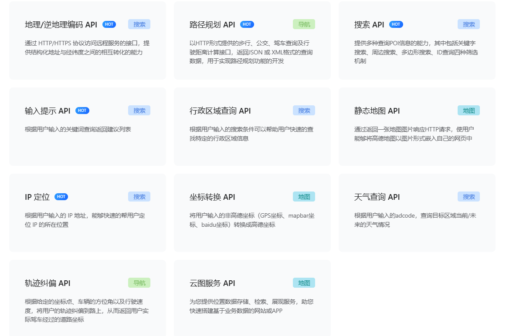
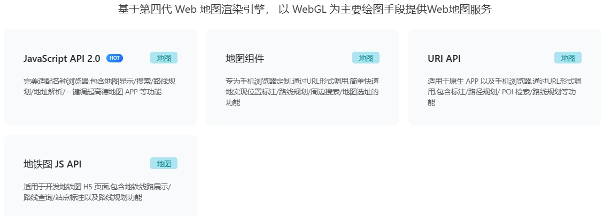

## 基于高德地图开发平台的校园地图web端开发

本项目针对新生和来校参观的游客。

具体实现功能还在商讨中。

---

### 1、background

**技术栈**:HTML+CSS+JS+web服务(高德)API+JS API(高德)+Vue.js(暂定)。

本项目自定义地图实现部分主要基于高德地图开发平台提供的**web服务API**和**JS API**。

**高德地图开发平台**是由中国领先的数字地图、导航和位置服务提供商之一的高德地图推出的开发者平台。该平台为开发者提供了一系列丰富的地图和位置相关的API和工具，帮助他们构建基于地理位置的应用程序和服务。

提供接口功能如下:

- web API：

- JS API

###  2、goals

<strong>1、地图</strong>

基础的地图图层，加上3D转换。包含楼宇、道路、车站等信息。

<strong>2、点击事件</strong>

- 显示地点信息（固定在侧边框）
- 收藏地点（尝试与课表结合现实上课楼宇）
- 地点信息选择性显示（通过勾选选择性显示）
- 选中地点高亮显示
- 导航前往选中地点

<strong>3、课表</strong>

- 导入课表方式（暂时搁置）
- 搜索或点击显示相应时段上课地点，导航前往

<strong>4、侧边栏</strong>

- 显示点击地点信息
- 包含搜索框，可以搜索热门问题（如校内快递点）
- 显示其他信息如天气等

